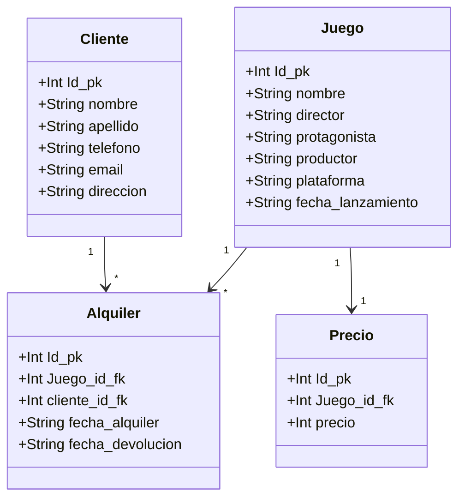

# FULLSTACK APP FOR SOPHOS
> App fullstack for game store management.

This APP handles both Backend functionalities, as well as Frontend UI. The App has 4 main categories that handles all of the options for each "Tab" which is an entity represented in the backend. the first render will always fetch all of the data present on the server for everyone of these tabs. On the bottom right corner all of the functionalities will appear, when selected, the modal will display the information depending on the action to perform. This is the main part of the app as it is the part which handles all the requests made on the Bakend.  

## Requirements
In order to install this project the following must be present on the machine.

- **FrontEnd**
	- node 18
	- npm 9.5
- **BackEnd**
	- Java 17
    - Apache Maven 3.9.0
- **Data Base**
    - Docker 20.10.22

## Installation
The App is build on React + Next.js for the Frontend, as well as Java + SpringBoot on the Backend. For the Database used in this example Postgres was used. However, the backend is developed in Hex Architecture and should be easy to swap databases i.e Mongo.

To install all the project's dependencies for the frontend you should run on the 'tienda_juegos' folder:

```sh
npm install
```
To install all the project's dependencies for the backend you should run on the 'rest_service' folder or where your pom file is located:

```sh
mvn clean package install
```
To install all the project's dependencies for the database, you should get the postgres image, and the pgadmin4 image, so run:

```sh
docker pull postgres
docker pull dpage/pgadmin4
```

## Usage example
Now that you have all the requirements you should run the following commands to get the project up, in the 'rest_service' folder run:
```sh
docker compose up
mvn spring-boot:run
```
now, on the "tienda_juegos" folder, run:
```sh
npm run dev
```

these commands will launch several things:
- **FrontEnd**
	- Next.js Front End App running on  [**127.0.0.1:3000**](127.0.0.1:3000) this will be the main UI address.
- **BackEnd**
	- Springboot App runnning on [**127.0.0.1:8080**](127.0.0.1:8080) this is an important address because all endpoints are running here.
	- The docker Compose up will also execute **'init.sql'** in order to create the tables needed for the project to work.
- **DataBase**
    - Postgres Dtabase runnning on [**127.0.0.1:5432**](127.0.0.1:5432)
    - Pg Admin 4 UI runnning on [**127.0.0.1:80**](127.0.0.1:80), the credentials are set admin@admin.com/admin

## API Testing And Specifications
While the intenderd way to test the functionalities provided by the Back End is to interact with it through the Front End itself, two other options are provided. First, You can import the file 'SOPHOS.postman_collections.json' into **Postman** and all of the endpoint will be available for testing, ***even some that didn't make it to the UI*** due to time constraints. Also, you can import the file 'SOPHOS.yaml' into Swagger Editor and test them from there and checkout the specifications of each endpoint.

## Data Base Design

The following Diagram corresponds to the design of the database and how each entity relates to one another.


## UI Prototype
This are the first scketches of the UI interface to be implemented on the FrontEnd app.
Landing Page, Tab, Cards, and Fab:


Modal on action and Card Zoom:


## Meta

Paul Martinez – martinezalcalaph@gmail.com

[https://github.com/xoxtomon](https://github.com/xoxtomon/)
